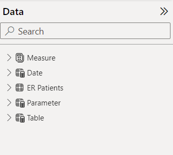
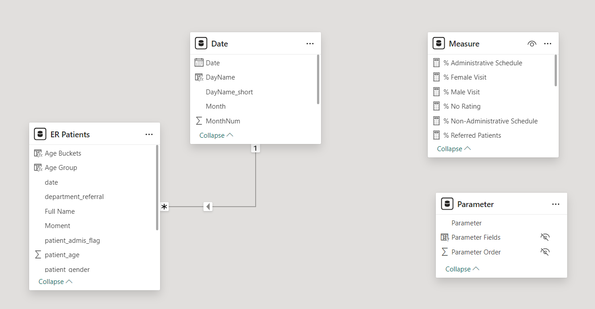
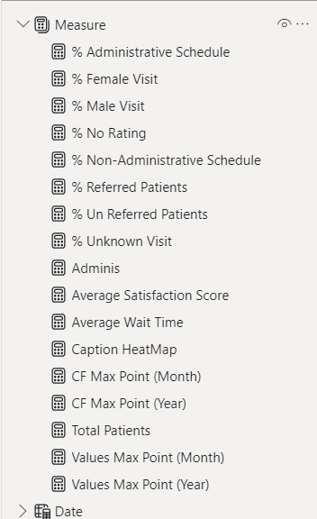
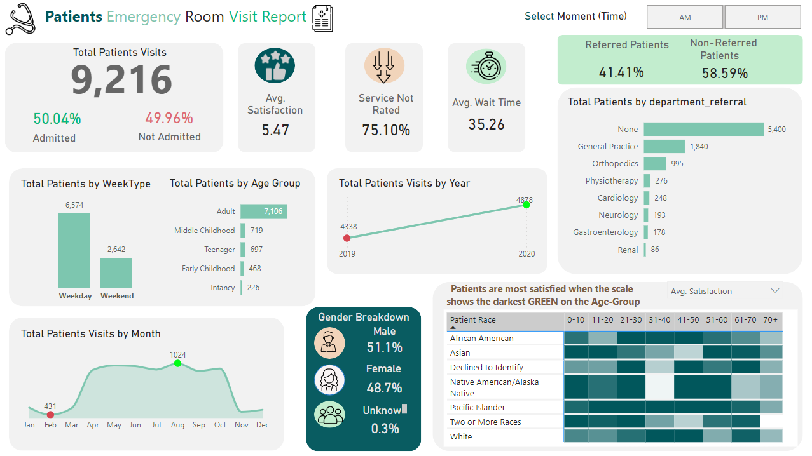

# Patients Emergency Room Visit PowerBI Report
## Overview
This PowerBI report provides insights into emergency room visits at a healthcare facility based on the provided dataset. It offers a high-level summary of various metrics related to patient visits, including admission status, satisfaction scores, wait times, and more.

## Dataset
The dataset used for this report contains information such as patient ID, gender, age, satisfaction score, race, admission flag, wait time, and department referral. Each record represents a patient's emergency room visit.

## Key Metrics
Utilized advanced DAX measures with variables and caption DAX measures for improved performance and readability.

- **Total Patient Visits:** Total number of patients who visited the emergency room.
- **Admitted vs. Not Admitted Patients:** Comparison of the number of patients admitted to the hospital versus those not admitted.
- **Average Satisfaction Score:** Average satisfaction score reported by patients.
- **Service Not Rated:** Number of patients who did not rate the service.
- **Average Wait Time:** Average wait time experienced by patients.
- **Total Patient Visits by Year:** Breakdown of patient visits by year.
- **Total Patients by Week Type:** Distribution of patient visits by week type (e.g., weekday, weekend).
- **Total Patient Visits by Month:** Distribution of patient visits by month.
- **Gender Breakdown:** Distribution of patient visits by gender.
- **Patients by Department Referral:** Number of patients referred to different departments.
- **Referred Patients:** Number of patients referred to specific departments.
- **Non-Referred Patients:** Number of patients not referred to any department.
- **Time (AM/PM):** Distribution of patient visits by time of day (AM/PM).

### Visualizations Used
Cards, bar Chart, column Chart, line Chart, dynamic heatmap utilizing field parameters, area chart, and slicers.

## Usage
1. **Data Import:** Import the provided dataset into PowerBI.
2. **Data Preparation:** Clean and shape the data as per the instructions.
3. **Report Creation:** Use the provided DAX measures to create visualizations.
4. **Interactivity:** Utilize slicers and filters for interactive analysis.
5. **Insights:** Analyze the visualizations to gain insights into emergency room visits.

## Credits
This report was created by Suraj Balraj.
